# Daily Trading Pipeline

## Trigger

Invoked daily at 10:00 AM CT:

```
python scripts/run_daily_trade.py --date YYYY-MM-DD --mode paper --bankroll 100.00 --config config/deploy_config.json
```

`TRACKJ_SKIP_HF_SYNC=1` is set automatically to avoid HuggingFace upload blocking live fetches.

## Pipeline Flowchart

```mermaid
flowchart TD
    start[main: run_daily_trade.py] --> dupCheck{Decision already in paper_trades.jsonl?}
    dupCheck -->|Yes| skipExit[Print skip message and return]
    dupCheck -->|No| waitOpen[_wait_for_market_open]

    waitOpen --> waitGate{Before 10:05 AM CT on event day?}
    waitGate -->|Yes| sleep60[Sleep 60s until 10:05 AM]
    sleep60 --> waitGate
    waitGate -->|Past 10:10 AM| abortOpen[Abort: markets not available]
    waitGate -->|Ready| fetchMarket

    fetchMarket[Stage 1: fetch_market] --> liveFetch[fetch_city_dates via Codex per city]
    liveFetch --> loadCsv[Load event-day rows from historic_tmax_market_data CSVs]
    loadCsv --> stabCheck1[fetch_kalshi_snapshot: k=1 stability check per city]
    stabCheck1 -->|fail| mktReason[Record market reason: stability not met / no data]

    stabCheck1 --> fetchForecast[Stage 2: fetch_forecast]
    fetchForecast --> cliWarm[Pre-warm: _load_cli_target for all 9 cities]
    cliWarm --> perCity[For each city in deploy_config cities]

    perCity --> loadModels[load_models: Ridge + Huber + LightGBM joblib]
    loadModels --> strictFeat[build_feature_vector_strict with feature_cols]

    strictFeat --> g1[Group 1: fetch_asos_morning skip_cache=True]
    strictFeat --> g2[Group 2: fetch_lag_features]
    strictFeat --> g3[Group 3: fetch_nws_forecast_full]
    strictFeat --> g4[Group 4: fetch_gfs_afternoon]
    strictFeat --> g5[Group 5: fetch_nwp_best]

    g1 & g2 & g3 & g4 & g5 --> featOk{All 5 groups + model cols non-NaN?}
    featOk -->|No| noSignal[Mark city no_signal with reason string]
    featOk -->|Yes| predict[predict_tmax_strict: mean of 3 models rounded to int F]

    predict --> computeEdge[Stage 3: compute_edge]
    computeEdge --> skipReason{City already in reasons dict?}
    skipReason -->|Yes| skipCity1[Skip city]
    skipReason -->|No| stabCheck2[filter_to_trading_window + stability_entry k=1]
    stabCheck2 -->|no_signal| skipCity2[Mark stability not met]
    stabCheck2 -->|entry| gaussProb[bucket_probs_from_point_forecast: T_hat + trackb_sigma_f]
    gaussProb --> scanBuckets[For each bucket at entry snapshot]
    scanBuckets --> guardrail{price >= floor AND has_edge: p-c > 2*fee?}
    guardrail -->|No| skipBucket[Skip bucket]
    guardrail -->|Yes| bestEdge[Keep highest-edge bucket per city]
    bestEdge -->|none pass| noBucket[Mark no bucket passes guardrails]

    bestEdge --> selectTrades[Stage 4: select_trades]
    selectTrades --> excluded{City in excluded_cities_oos?}
    excluded -->|Yes| skipOOS[Skip excluded city]
    excluded -->|No| edgeThresh{edge >= edge_threshold from deploy_config?}
    edgeThresh -->|No| skipThresh[Mark edge below threshold]
    edgeThresh -->|Yes| ranked[Add to selected list sorted by edge desc]

    ranked --> sizePos[Stage 5: size_positions]
    sizePos --> contracts{bankroll < bankroll_reduction_threshold?}
    contracts -->|Yes| n3[3 contracts per trade]
    contracts -->|No| n5[5 contracts per trade]
    n3 & n5 --> capTrim{total capital_at_risk > daily_loss_cap?}
    capTrim -->|Yes| dropLow[Drop lowest-edge trade and retry]
    dropLow --> capTrim
    capTrim -->|No| sizedList[Final sized trade list]

    sizedList --> modeCheck{mode == live?}
    modeCheck -->|Yes| placeOrders[place_order via kalshi_api per trade]
    modeCheck -->|No| paperSkip[No orders placed]

    placeOrders & paperSkip --> logDec[Stage 6: log_decision]
    logDec --> appendJsonl[Append JSON to logs/paper_trades.jsonl]

    appendJsonl --> riskRpt[Stage 7: daily_risk_report]
    riskRpt --> paperBanner{mode == paper?}
    paperBanner -->|Yes| manualNote[Print PAPER banner: review and enter manually]
    paperBanner -->|No| liveNote[Orders already placed]

    manualNote & liveNote --> settleLater[Next morning: settle_daily.py]
    settleLater --> cliSettle[Fetch NWS CLI Tmax per traded city]
    cliSettle --> pnlCalc[Compute win/loss vs bucket; net PnL after fees]
    pnlCalc --> settleLog[Append to logs/settlements.jsonl]
```



## Stage Summary

| Stage | Function | Purpose |
|-------|----------|---------|
| 0 | `main()` duplicate check | Skip if `paper_trades.jsonl` already has entry for date+mode |
| 0 | `_wait_for_market_open()` | On event day, wait until 10:05 AM CT (abort after 10:10 AM) |
| 1 | `fetch_market()` | Live Codex fetch + local CSV load; verify k=1 stability per city |
| 2 | `fetch_forecast()` | CLI pre-warm; strict feature vector; Track-B ensemble prediction |
| 3 | `compute_edge()` | Gaussian bucket probs; best bucket passing price floor and `has_edge` |
| 4 | `select_trades()` | Filter by `edge_threshold`; skip `excluded_cities_oos` |
| 5 | `size_positions()` | Flat 5 contracts (3 if bankroll < $85); trim to `daily_loss_cap` |
| 6 | `log_decision()` | Append structured JSONL to `logs/paper_trades.jsonl` |
| 7 | `daily_risk_report()` | Human-readable stdout summary |

## Data Source Details

### Group 1 — ASOS morning observations

| Item | Detail |
|------|--------|
| Orchestrator | `fetch_asos_morning()` in `src/data_pipeline.py` |
| Fetcher | `fetch_asos_range()` in `src/trackj/build_asos_features.py` |
| API | IEM ASOS: `https://mesonet.agron.iastate.edu/cgi-bin/request/asos.py` |
| Features | 9 cols: `temp_10am`, `temp_mean_00_10`, `temp_max_so_far_00_10`, dewpoint, RH, pressure, wind u/v, cloud cover |
| Timeout / retry | 10s timeout; urllib3 Retry total=2 |
| Live behavior | `overwrite=True` when `skip_cache=True` (forces refresh of monthly CSV) |
| Failure | Returns `None` → strict build reports `"missing ASOS obs"` |

### Group 2 — Calendar and lag features

| Item | Detail |
|------|--------|
| Orchestrator | `fetch_lag_features()` in `src/data_pipeline.py` |
| CLI loader | `_load_cli_target()` — bootstraps/refreshes 45-day CLI history through D-1 |
| Fetcher | `fetch_cli_target()` in `src/trackj/fetch_cli_target.py` |
| API | IEM AFOS retrieve: `https://mesonet.agron.iastate.edu/cgi-bin/afos/retrieve.py` |
| Features | 9 cols: `doy_sin`, `doy_cos`, `tmax_lag1/2/3/7`, `tmax_rollmean_7/30`, `temp_lag1` |
| Timeout / retry | 10s timeout; Retry total=2 |
| Pre-warm | `fetch_forecast()` calls `_load_cli_target()` for all cities before per-city build |
| Failure | Returns `None` → `"missing lag features"` or `"missing model features: ..."` |

### Group 3 — NWS MOS Tmax forecast

| Item | Detail |
|------|--------|
| Orchestrator | `fetch_nws_forecast_full()` in `src/data_pipeline.py` |
| Fetcher | `fetch_nws_tmax_forecast()` in `src/trackj/fetch_nws_forecast.py` |
| API | IEM MOS: `https://mesonet.agron.iastate.edu/cgi-bin/request/mos.py` (NBE/NBS/GFS by date) |
| Features | `nws_tmax_forecast_f`, `nws_tmax_forecast_issued_h` |
| Selection | Latest evening-cycle runtime before prior-day 22:00 local |
| Leakage guard | Rejects issuance ≥ 10:00 AM local on event day |
| Timeout / retry | 10s timeout; Retry total=2 |
| Failure | Returns `None` → `"missing NWS MOS"` |

### Group 4 — GFS afternoon covariates

| Item | Detail |
|------|--------|
| Orchestrator | `fetch_gfs_afternoon()` in `src/data_pipeline.py` |
| Fetcher | `fetch_gfs_for_date()` in `src/trackj/fetch_gfs_herbie.py` |
| Source | Herbie GFS `pgrb2.0p25` (TMP/DPT/TCDC at station lat/lon) |
| Features | `gfs_t2m_afternoon`, `gfs_dewpoint_afternoon`, `gfs_cloudcover_afternoon` |
| Cache | `data/raw/gfs_<station>/<station>_gfs_YYYYMMDD.csv` |
| Availability | 6-hour lag filter; tries candidate init/fxx pairs (00Z f21, 06Z f15, etc.) |
| Leakage guard | Requires `fxx > 0` |
| Failure | Returns `None` → `"missing GFS afternoon covariates"` |

### Group 5 — NWP best Tmax

| Item | Detail |
|------|--------|
| Orchestrator | `fetch_nwp_best()` in `src/data_pipeline.py` |
| Fetcher | `fetch_openmeteo_tmax()` in `src/trackj/fetch_openmeteo_nwp.py` |
| API | Open-Meteo live: `https://api.open-meteo.com/v1/forecast` (within 7 days) |
| Priority | ECMWF IFS (`ecmwf_ifs025`) → GFS seamless → NWS MOS fallback |
| Features | `nwp_tmax_best_f` |
| Leakage guard | Rejects `issued_date >= event_date` |
| Timeout / retry | 10s timeout; Retry total=2 |
| Failure | Returns `None` → `"missing NWP best Tmax"` |

## Edge and Selection Logic

**Per-bucket guardrails** (`compute_edge`):
- `entry_price >= price_floor` (default $0.15 from `deploy_config.json`)
- `has_edge(model_prob, entry_price, fee)`: `(p − c) > 2 × fee`
- Fee: `taker_fee_cents(1, price) / 100` via `src/sizing.py`

**Trade selection** (`select_trades`):
- Skip cities in `excluded_cities_oos` (e.g. austin, philadelphia)
- Require `edge >= edge_threshold` (default 0.037)
- Trades implicitly ranked by edge (input list sorted descending)

**Sizing** (`size_positions`):
- 5 contracts default; 3 if `bankroll < bankroll_reduction_threshold` ($85)
- Drop lowest-edge trades until `sum(capital_at_risk) <= daily_loss_cap` ($6)

## Timing

| Time (CT) | Action |
|-----------|--------|
| ~05:00 AM | GFS 00Z data typically available |
| ~08:00 AM | Pre-flight: verify GFS/ECMWF availability (manual, per week3 plan) |
| 09:30 AM | Optional: run feature pipeline / `fetch_and_validate.py` |
| 10:00 AM | Run `run_daily_trade.py` |
| 10:05 AM | Pipeline waits until this time before proceeding on event day |
| 10:05 AM | Review trade recommendations in stdout / `paper_trades.jsonl` |
| 10:10 AM | Manual entry deadline reference (pipeline aborts market wait after this) |
| Next AM | Run `settle_daily.py` once CLI Tmax posts (~morning after event) |

## Settlement

`scripts/settle_daily.py` runs separately (not inside `run_daily_trade.py`):

1. Load paper decision from `logs/paper_trades.jsonl` for the event date.
2. For each trade in `decision["trades"]`:
   - Fetch settled CLI Tmax via `_load_cli_target()` / `fetch_cli_target()`.
   - Determine win/loss: `_tmax_in_bucket(cli_tmax, bucket_label)`.
   - Compute net PnL: `_trade_pnl_cents()` using `src/fees.net_pnl()` with taker fees.
3. Append settlement record to `logs/settlements.jsonl`.
4. Print daily and cumulative PnL summary.

If CLI Tmax is unavailable for a city, that trade is skipped with a console message.

## Not Yet Implemented

- `market_monitor.py` (intraday 5-minute monitoring) — referenced in week3 plan but not in codebase.
