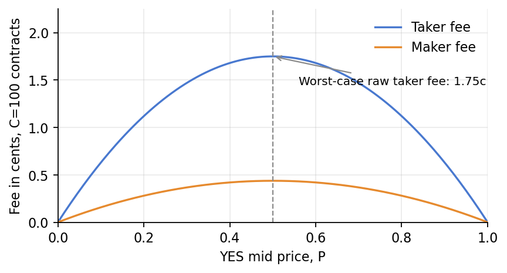
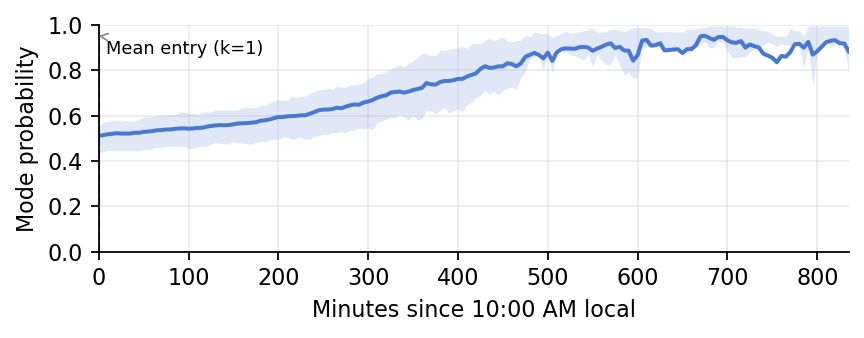
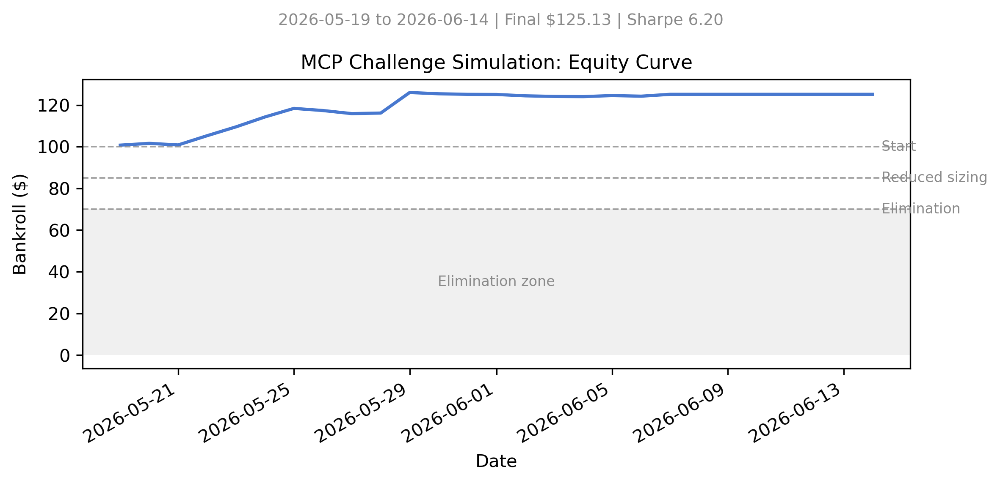
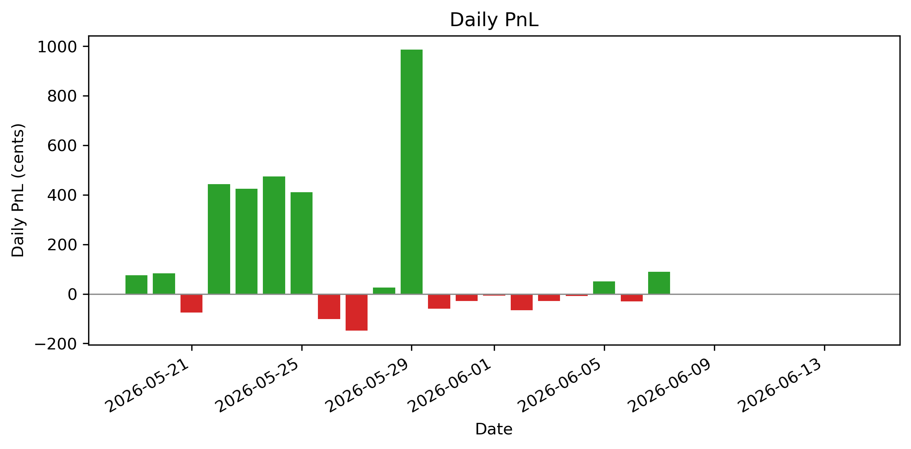
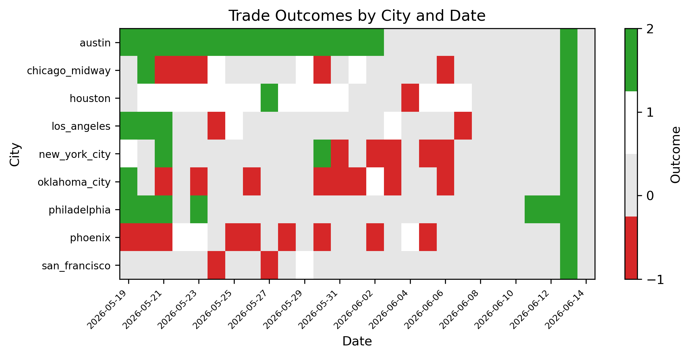
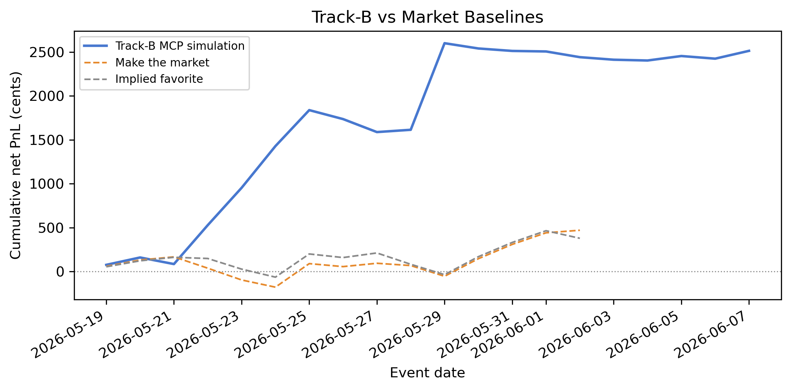
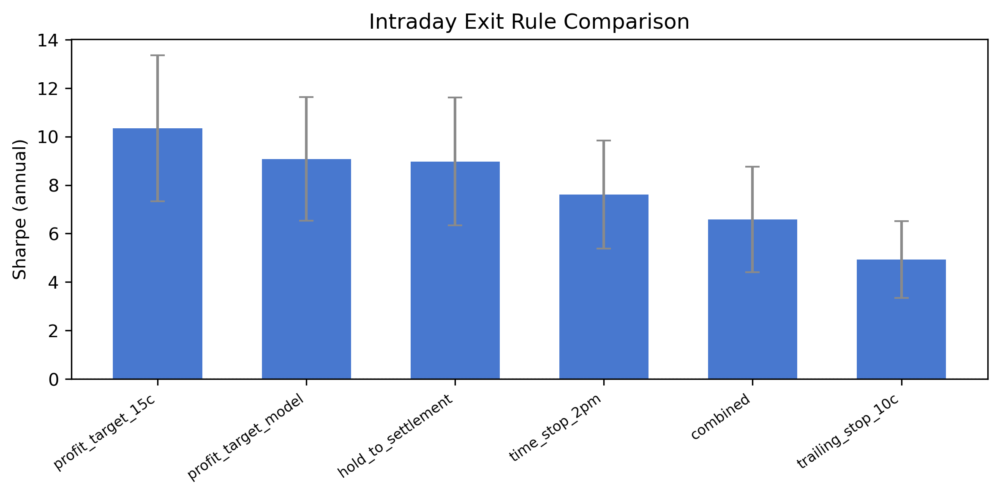
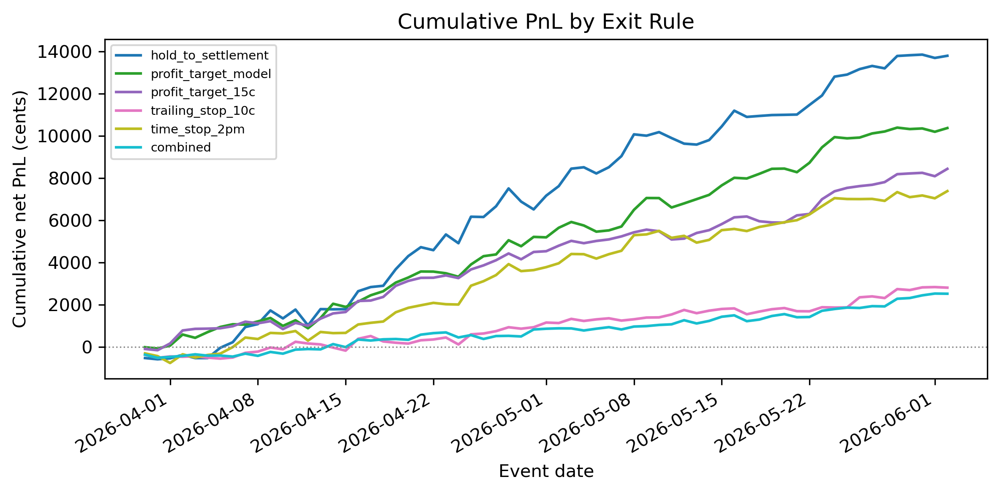

```{python}
#| label: setup
#| include: false
from __future__ import annotations

import json
import sys
from pathlib import Path

import matplotlib

matplotlib.use("Agg")
import matplotlib.pyplot as plt
import numpy as np
import pandas as pd

PROJECT_ROOT = Path.cwd().parent if Path.cwd().name == "reports" else Path.cwd()
if str(PROJECT_ROOT / "src") not in sys.path:
    sys.path.insert(0, str(PROJECT_ROOT / "src"))
if str(PROJECT_ROOT / "src" / "baselines") not in sys.path:
    sys.path.insert(0, str(PROJECT_ROOT / "src" / "baselines"))

from fees import maker_fee, taker_fee
from entry_interface import filter_to_trading_window
from snapshot_stability import stability_entry
from backtest_utils import daily_returns, sharpe_stats

RAW_DATA_DIR = PROJECT_ROOT / "historic_tmax_market_data"
SPLIT_DIR = PROJECT_ROOT / "data" / "splits"
REPORT_DIR = PROJECT_ROOT / "reports"
FIGURE_DIR = REPORT_DIR / "figures"
FIGURE_DIR.mkdir(parents=True, exist_ok=True)
CSV_PATTERN = "*/*tmax_kalshi*5min_same_day.csv"
HOLDOUT_CITIES = ["miami", "denver", "minneapolis"]
TIME_HOLDOUT_DAYS = 15
REPORT_COLUMNS = {
    "event_date",
    "city",
    "snapshot_time_local",
    "bucket_label",
    "bucket_type",
    "bucket_lower_inclusive_f",
    "bucket_upper_inclusive_f",
    "bucket_resolved_to_one_dollars",
    "contract_resolved_side",
    "yes_bid_close",
    "yes_ask_close",
    "yes_mid_close",
    "minutes_before_tmax",
}
PALETTE = {
    "blue": "#4878CF",
    "orange": "#E68A2E",
    "grey": "#8A8A8A",
    "light_blue": "#D9E3F7",
    "light_orange": "#F7DFC6",
    "light_grey": "#E6E6E6",
    "light_green": "#DDEBDD",
}

plt.rcParams.update(
    {
        "figure.dpi": 130,
        "axes.spines.top": False,
        "axes.spines.right": False,
        "axes.grid": True,
        "grid.alpha": 0.25,
        "font.size": 10,
    }
)


def latex_escape(value: object) -> str:
    text = "" if pd.isna(value) else str(value)
    replacements = {
        "\\": r"\textbackslash{}",
        "&": r"\&",
        "%": r"\%",
        "$": r"\$",
        "#": r"\#",
        "_": r"\_",
        "{": r"\{",
        "}": r"\}",
        "~": r"\textasciitilde{}",
        "^": r"\textasciicircum{}",
    }
    return "".join(replacements.get(char, char) for char in text)


def latex_table(
    df: pd.DataFrame,
    caption: str,
    label: str,
    column_format: str,
    note=None,
) -> str:
    table = df.to_latex(
        index=False,
        escape=False,
        caption=caption,
        label=label,
        column_format=column_format,
    )
    if note is None:
        return table
    return table.replace(
        r"\end{tabular}",
        rf"\end{{tabular}}" "\n" rf"\par\smallskip\footnotesize{{{note}}}",
    )


def compact_latex_table(table_latex: str) -> str:
    table_latex = table_latex.replace(
        r"\begin{tabular}",
        r"\begingroup"
        "\n"
        r"\footnotesize"
        "\n"
        r"\setlength{\tabcolsep}{2pt}"
        "\n"
        r"\renewcommand{\arraystretch}{0.82}"
        "\n"
        r"\resizebox{\textwidth}{!}{%"
        "\n"
        r"\begin{tabular}",
    )
    return table_latex.replace(
        r"\end{tabular}",
        r"\end{tabular}%" "\n" r"}" "\n" r"\endgroup",
    )


def fmt_float(value: float, digits: int = 2) -> str:
    return "—" if pd.isna(value) else f"{value:0.{digits}f}"


def fmt_int_or_dash(value: float) -> str:
    return "—" if pd.isna(value) else f"{int(round(value))}"


def load_market_df() -> pd.DataFrame:
    csv_paths = sorted(RAW_DATA_DIR.glob(CSV_PATTERN))
    if not csv_paths:
        raise FileNotFoundError(f"No CSV files matched {RAW_DATA_DIR / CSV_PATTERN}")

    frames = []
    for path in csv_paths:
        city_folder = path.parent.name
        available_columns = pd.read_csv(path, nrows=0).columns
        usecols = [column for column in available_columns if column in REPORT_COLUMNS]
        df = pd.read_csv(path, usecols=usecols)
        if "city" not in df.columns:
            df["city"] = city_folder.replace("_", " ").title()
        df["event_date"] = pd.to_datetime(df["event_date"]).dt.date
        df["snapshot_time_local"] = pd.to_datetime(df["snapshot_time_local"])
        df["source_city_folder"] = city_folder
        frames.append(df)
    return pd.concat(frames, ignore_index=True, sort=False)


def read_partitions() -> dict[str, pd.DataFrame]:
    names = ["threshold_opt", "time_holdout", "location_holdout"]
    return {name: pd.read_parquet(SPLIT_DIR / f"{name}.parquet") for name in names}


def day_group_columns(partition_df: pd.DataFrame) -> list[str]:
    city_col = (
        "source_city_folder"
        if "source_city_folder" in partition_df.columns
        else "city"
    )
    return [city_col, "event_date"]


def load_frozen_k() -> int:
    with open(SPLIT_DIR / "frozen_k.json", encoding="utf-8") as handle:
        return int(json.load(handle)["k"])


def ten_am_reference(snapshot_time: pd.Timestamp) -> pd.Timestamp:
    return snapshot_time.replace(hour=10, minute=0, second=0, microsecond=0)


def compute_mode_prob_curve(partition_df: pd.DataFrame) -> pd.DataFrame:
    df = partition_df.copy()
    df["snapshot_time_local"] = pd.to_datetime(df["snapshot_time_local"])
    group_cols = day_group_columns(df)
    df = pd.concat(
        [
            filter_to_trading_window(day_df)
            for _, day_df in df.groupby(group_cols, sort=True)
        ],
        ignore_index=True,
    )
    curve = (
        df.dropna(subset=["snapshot_time_local"])
        .assign(yes_mid_close=lambda frame: frame["yes_mid_close"].astype(float))
        .groupby([*group_cols, "snapshot_time_local"], sort=True)["yes_mid_close"]
        .max()
        .reset_index(name="mode_prob")
    )
    reference_times = curve["snapshot_time_local"].map(ten_am_reference)
    curve["minutes_elapsed"] = (
        curve["snapshot_time_local"] - reference_times
    ).dt.total_seconds() / 60.0
    return curve[["minutes_elapsed", "mode_prob"]]


def mean_stability_entry_minutes(partition_df: pd.DataFrame, k: int) -> float:
    smoke_path = SPLIT_DIR / "smoke_test_results" / "implied_favorite_IS.parquet"
    if smoke_path.exists():
        implied_favorite = pd.read_parquet(smoke_path)
        entry_times = pd.to_datetime(
            implied_favorite.loc[
                ~implied_favorite["no_signal"].fillna(False),
                "entry_time",
            ]
        ).dropna()
        if not entry_times.empty:
            return float(
                np.mean(
                    [
                        (entry_time - ten_am_reference(entry_time)).total_seconds()
                        / 60.0
                        for entry_time in entry_times
                    ]
                )
            )

    df = partition_df.copy()
    df["snapshot_time_local"] = pd.to_datetime(df["snapshot_time_local"])
    group_cols = day_group_columns(df)
    df = pd.concat(
        [
            filter_to_trading_window(day_df)
            for _, day_df in df.groupby(group_cols, sort=True)
        ],
        ignore_index=True,
    )
    entry_minutes: list[float] = []

    for _, day_df in df.groupby(group_cols, sort=True):
        day = day_df.sort_values("snapshot_time_local")
        snapshot_times = list(day["snapshot_time_local"].dropna().drop_duplicates())
        if not snapshot_times:
            continue
        signal = stability_entry(day, k=k)
        if signal.no_signal:
            continue
        entry_time = pd.Timestamp(signal.entry_snapshot_time)
        entry_minutes.append(
            (entry_time - ten_am_reference(entry_time)).total_seconds() / 60.0
        )

    if not entry_minutes:
        return float("nan")
    return float(np.mean(entry_minutes))


def emit_figure(
    relative_path: Path,
    caption: str,
    label: str,
    *,
    width: str | None = None,
) -> None:
    rel = relative_path.name if relative_path.parent == FIGURE_DIR else relative_path.as_posix()
    if not rel.startswith("figures/"):
        rel = f"figures/{relative_path.name}"
    escaped = caption.replace('"', "'")
    width_attr = f" width={width}" if width else ""
    print(f'{{#{label}{width_attr} fig-cap="{escaped}"}}')


market_df = load_market_df()
partitions = read_partitions()
frozen_k = load_frozen_k()
threshold_opt = partitions["threshold_opt"]
mode_prob_curve = compute_mode_prob_curve(threshold_opt)
mean_entry_minutes = mean_stability_entry_minutes(threshold_opt, frozen_k)
```

# Data and Market Structure

## Overview

This project evaluates trading strategies for Kalshi same-day maximum temperature (Tmax) prediction markets across 12 US cities. Each trading day, Kalshi offers a set of mutually exclusive 2°F-wide temperature buckets covering the plausible Tmax range. One bucket resolves to \$1 (YES wins); all others resolve to \$0. Settlement uses the official NWS Daily Climate Report (CLI) for each city's ASOS station. The dataset contains 5-minute market snapshots from March 30 to June 14, 2026, restricted to the post-10:00 AM local time trading window. Table \ref{tbl-city-inventory} summarises the city-level inventory.

```{python}
#| label: tbl-city-inventory
#| output: asis
city_inventory = (
    market_df.groupby("source_city_folder")
    .agg(
        **{
            "N days": ("event_date", "nunique"),
            "N snapshots": ("snapshot_time_local", "nunique"),
            "First date": ("event_date", "min"),
            "Last date": ("event_date", "max"),
        }
    )
    .reset_index()
    .sort_values("source_city_folder")
)
city_inventory["City"] = city_inventory["source_city_folder"].map(latex_escape)
city_inventory.loc[
    city_inventory["source_city_folder"].str.casefold().isin(HOLDOUT_CITIES), "City"
] += r"$\dagger$"
city_inventory["First date"] = city_inventory["First date"].astype(str)
city_inventory["Last date"] = city_inventory["Last date"].astype(str)
city_inventory["N days"] = city_inventory["N days"].astype(int)
city_inventory["N snapshots"] = city_inventory["N snapshots"].astype(int)
city_table = city_inventory[
    ["City", "N days", "N snapshots", "First date", "Last date"]
]
table_latex = latex_table(
    city_table,
    caption="City inventory with N days, N snapshots, and date range.",
    label="tbl-city-inventory",
    column_format="lrrrr",
    note=r"$\dagger$ Held-out city: not used for parameter tuning.",
)
print(compact_latex_table(table_latex))
```

## Evaluation Design

The dataset is split along both time and location axes (Figure \ref{fig-split-design}). Nine train cities are used for model development; three holdout cities (Denver, Miami, Minneapolis) are reserved for generalisation testing and are never used for parameter tuning. The time axis assigns the most recent 15 calendar dates to an out-of-sample (OOS) partition (time\_holdout), with earlier dates forming the in-sample partition (threshold\_opt). A fresh validation window (June 3--14, 2026) extends beyond the original time\_holdout partition to test deployment readiness on the most recent market data. A final true\_holdout partition (holdout cities × OOS dates) is never inspected until final reporting.

```{python}
#| label: fig-split-design
#| output: asis
threshold_days = partitions["threshold_opt"]["event_date"].nunique()
oos_days = partitions["time_holdout"]["event_date"].nunique()
train_city_count = partitions["threshold_opt"]["source_city_folder"].nunique()
holdout_city_count = partitions["location_holdout"]["source_city_folder"].nunique()
design_days = threshold_days + oos_days
summary = {
    name: {
        "rows": len(df),
        "cities": df["source_city_folder"].nunique() if not df.empty else 0,
        "days": df["event_date"].nunique() if not df.empty else 0,
    }
    for name, df in partitions.items()
}
summary["true_holdout"] = {
    "rows": 0,
    "cities": holdout_city_count,
    "days": oos_days,
}
missing_holdouts = [
    city
    for city in HOLDOUT_CITIES
    if city not in set(partitions["location_holdout"]["source_city_folder"].astype(str))
]

fig, ax = plt.subplots(figsize=(6.0, 2.4))
ax.set_xlim(0, design_days)
ax.set_ylim(0, 2)
ax.set_xticks([threshold_days / 2, threshold_days + oos_days / 2])
ax.set_xticklabels(
    [
        f"IS: days 1 to N-{TIME_HOLDOUT_DAYS}\n(threshold_opt)",
        f"OOS: last {TIME_HOLDOUT_DAYS} days\n(time_holdout)",
    ],
    fontsize=8,
)
ax.set_yticks([1.5, 0.5])
ax.set_yticklabels(
    [
        f"Train cities (N={train_city_count})",
        f"Holdout cities (N={holdout_city_count})",
    ],
    fontsize=8,
)
ax.set_xlabel(f"Time axis, N={design_days} calendar dates", labelpad=6)
ax.set_ylabel("Location axis")
ax.grid(False)

quadrants = [
    ("threshold_opt", 0, 1, threshold_days, 1, PALETTE["light_blue"]),
    ("time_holdout", threshold_days, 1, oos_days, 1, PALETTE["light_orange"]),
    ("location_holdout", 0, 0, threshold_days, 1, PALETTE["light_grey"]),
    ("true_holdout", threshold_days, 0, oos_days, 1, PALETTE["light_green"]),
]
for name, x, y, width, height, color in quadrants:
    hatch = "///" if missing_holdouts and name in {"location_holdout", "true_holdout"} else None
    label = (
        f"{name}\n{summary[name]['rows']:,} rows"
        if name != "true_holdout"
        else "true_holdout\nnot inspected"
    )
    if hatch:
        label = f"{name}\npending data"
    rect = plt.Rectangle(
        (x, y),
        width,
        height,
        facecolor=color,
        edgecolor=PALETTE["grey"],
        linewidth=1,
        hatch=hatch,
    )
    ax.add_patch(rect)
    ax.text(
        x + width / 2,
        y + height / 2,
        label,
        ha="center",
        va="center",
        fontsize=8,
    )

ax.axvline(threshold_days, color=PALETTE["grey"], linewidth=1)
ax.axhline(1, color=PALETTE["grey"], linewidth=1)
footnote = (
    "True holdout will not be inspected until final reporting. "
    "Location holdout cities: miami, denver, minneapolis."
)
fig.subplots_adjust(bottom=0.28)
fig.text(0.5, 0.03, footnote, ha="center", va="bottom", fontsize=8)
split_figure_path = FIGURE_DIR / "split_design.png"
fig.savefig(split_figure_path, bbox_inches="tight", dpi=160, pad_inches=0.15)
plt.close(fig)
emit_figure(
    split_figure_path,
    "Train/test partition design. The IS window expands as new daily data is added; "
    "the OOS window always covers the last 15 days.",
    "fig-split-design",
    width="85%",
)
```

## Fee Model

All profit and loss figures are reported net of Kalshi fees. The taker fee in cents is $\lceil 0.07 \cdot C \cdot P \cdot (1-P) \rceil$ and the maker fee is $\lceil 0.0175 \cdot C \cdot P \cdot (1-P) \rceil$, where $C$ is the number of contracts and $P$ is the YES mid price. The ceiling function creates a 1-cent minimum per trade; for positions under approximately 57 contracts, the fee is pinned at 1 cent regardless of size. Figure \ref{fig-fee-curve} shows the fee schedule for $C = 100$ contracts. A no-trade guardrail skips any bucket where the estimated edge $(p - c)$ is less than twice the per-contract fee, and a price floor excludes buckets priced below \$0.15.

```{python}
#| label: fig-fee-curve
#| output: asis
contracts = 100
probabilities = np.linspace(0, 1, 201)
raw_taker = 0.07 * contracts * probabilities * (1 - probabilities)
raw_maker = 0.0175 * contracts * probabilities * (1 - probabilities)
rounded_taker = np.array([taker_fee(contracts, float(p)) for p in probabilities])
rounded_maker = np.array([maker_fee(contracts, float(p)) for p in probabilities])

fig, ax = plt.subplots(figsize=(5.5, 3.0))
ax.plot(probabilities, raw_taker, color=PALETTE["blue"], label="Taker fee")
ax.plot(probabilities, raw_maker, color=PALETTE["orange"], label="Maker fee")
ax.axvline(0.50, color=PALETTE["grey"], linestyle="--", linewidth=1)
ax.annotate(
    "Worst-case raw taker fee: 1.75c",
    xy=(0.50, 1.75),
    xytext=(0.56, 1.45),
    arrowprops={"arrowstyle": "->", "color": PALETTE["grey"]},
    fontsize=9,
)
ax.set_xlabel("YES mid price, P")
ax.set_ylabel("Fee in cents, C=100 contracts")
ax.set_xlim(0, 1)
ax.set_ylim(0, max(rounded_taker) + 0.25)
ax.legend(frameon=False)
plt.tight_layout()
fee_figure_path = FIGURE_DIR / "fee_curve.png"
fig.savefig(fee_figure_path, bbox_inches="tight", dpi=160)
plt.close(fig)
```

# Market Baselines and Efficiency

## Baseline Definitions

Seven market baselines test whether simple rules extract profit from the Tmax bucket structure. Entry timing uses a snapshot-stability rule: the first post-10:00 AM snapshot at which the modal bucket (highest YES mid price) has been unchanged for $k = 1$ consecutive 5-minute interval, which in practice fires immediately at market open. The implied-favorite baseline enters long on the modal bucket at this snapshot. The distribution-copy baseline allocates capital across all buckets proportional to fee-adjusted price, serving as a theoretical zero-edge benchmark. The sell-longshots baseline shorts any bucket crossing below \$0.10 after the stability snapshot, motivated by the documented favorite--longshot bias. The make-the-market baseline quotes one cent inside the modal bucket spread until a maker fill arrives. Three signal-threshold baselines enter when mode probability exceeds $t^* = 0.88$ (mode-prob), Shannon entropy falls below $H^* = 0.45$ (entropy), or mode probability momentum exceeds $d^* = 0.02$ over $w^* = 16$ snapshots (momentum). Threshold values were frozen on the in-sample partition.

## Intraday Market Dynamics

Figure \ref{fig-mode-probability} shows the average post-10 AM intraday mode probability across all train-city trading days, illustrating how the market concentrates toward a dominant bucket as the day progresses.

```{python}
#| label: fig-mode-probability
#| output: asis
summary = (
    mode_prob_curve.groupby("minutes_elapsed")["mode_prob"]
    .agg(mean="mean", q25=lambda values: values.quantile(0.25), q75=lambda values: values.quantile(0.75))
    .reset_index()
    .sort_values("minutes_elapsed")
)
x = summary["minutes_elapsed"].to_numpy()
mean = summary["mean"].to_numpy()
q25 = summary["q25"].to_numpy()
q75 = summary["q75"].to_numpy()
fig, ax = plt.subplots(figsize=(5.5, 2.2))
ax.fill_between(
    x,
    q25,
    q75,
    color=PALETTE["light_blue"],
    alpha=0.8,
    linewidth=0,
)
ax.plot(
    x,
    mean,
    color=PALETTE["blue"],
    linewidth=1.8,
    label="Mean mode_prob",
)
if pd.notna(mean_entry_minutes):
    ax.axvline(
        mean_entry_minutes,
        color=PALETTE["grey"],
        linestyle="--",
        linewidth=1,
    )
    ax.annotate(
        f"Mean entry (k={frozen_k})",
        xy=(mean_entry_minutes, float(mean.max())),
        xytext=(mean_entry_minutes + 8, float(mean.max()) - 0.08),
        fontsize=8,
        arrowprops={"arrowstyle": "->", "color": PALETTE["grey"], "lw": 0.8},
    )
ax.set_xlabel("Minutes since 10:00 AM local")
ax.set_ylabel("Mode probability")
ax.set_xlim(0, float(x.max()))
ax.set_ylim(0, 1)
plt.tight_layout()
mode_prob_path = FIGURE_DIR / "mode_probability_curve.png"
fig.savefig(mode_prob_path, bbox_inches="tight", dpi=160)
plt.close(fig)
```

::: {layout-ncol=2}

{#fig-fee-curve width=100%}

{#fig-mode-probability width=100%}

:::

## Baseline Results

Table \ref{tbl-baseline-is-oos} reports IS and OOS statistics for all seven baselines. No baseline achieves a positive deflated Sharpe or meets the minimum track record length (MinTRL) required for statistical significance at the 5\% level. The Spearman rank correlation between IS and OOS Sharpe is 0.036, indicating that IS rankings provide essentially no information about OOS performance. Three baselines show positive OOS point estimates (make-the-market 1.45, momentum 1.36, implied-favorite 1.16), but all 95\% confidence intervals include zero. Furthermore, 138\% of combined OOS PnL is concentrated in the top three trading days, suggesting these positive results are driven by a small number of favorable days rather than a persistent signal.

```{python}
#| label: tbl-baseline-is-oos
#| output: asis
smoke_dir = SPLIT_DIR / "smoke_test_results"
oos_dir = SPLIT_DIR / "oos_results"
full_stats = pd.read_csv(smoke_dir / "full_stats_table_IS.csv")
oos_stats = pd.read_csv(oos_dir / "full_stats_table_OOS.csv")
merged = full_stats.merge(oos_stats, on="Baseline", suffixes=("_IS", "_OOS"))

is_day_equiv = len(
    partitions["threshold_opt"][["source_city_folder", "event_date"]].drop_duplicates()
)
oos_day_equiv = len(
    partitions["time_holdout"][["source_city_folder", "event_date"]].drop_duplicates()
)

table2 = pd.DataFrame(
    {
        "Baseline": merged["Baseline"].str.replace("_", " ", regex=False),
        "IS N": merged["N_trades_IS"].astype(int),
        "OOS N": merged["N_trades_OOS"].astype(int),
        "IS SR": merged["Sharpe_IS"].map(lambda value: fmt_float(value, 2)),
        "OOS SR": merged["Sharpe_OOS"].map(lambda value: fmt_float(value, 2)),
        "OOS CI": merged.apply(
            lambda row: (
                "—"
                if pd.isna(row["Sharpe_OOS"])
                else f"[{row['Sharpe_CI_low_OOS']:0.2f}, {row['Sharpe_CI_high_OOS']:0.2f}]"
            ),
            axis=1,
        ),
        "PSR(0)": merged["PSR_0_OOS"].map(lambda value: fmt_float(value, 2)),
        "Sortino": merged["Sortino_OOS"].map(lambda value: fmt_float(value, 2)),
        "Max DD": merged["MaxDrawdown_OOS"].map(lambda value: fmt_float(value, 2)),
    }
)
table2_latex = latex_table(
    table2,
    caption=(
        f"IS and OOS statistics for all seven market baselines. "
        f"IS uses threshold\\_opt ({is_day_equiv} day-equiv); "
        f"OOS uses time\\_holdout ({oos_day_equiv} day-equiv). "
        "No re-optimisation occurred between partitions."
    ),
    label="tbl-baseline-is-oos",
    column_format="lrrrrrrrr",
)
print(compact_latex_table(table2_latex))
```

## IS versus OOS Comparison

Figure \ref{fig-day5-is-oos-sharpe} compares IS and OOS Sharpe across baselines; the pronounced rank inversion and wide OOS confidence intervals underscore the preliminary nature of any performance claim on 108 day-equivalents.

```{python}
#| label: fig-day5-is-oos-sharpe
#| output: asis
comparison = pd.read_csv(oos_dir / "is_oos_comparison.csv")
plot_df = comparison.sort_values("OOS_Sharpe", ascending=True).reset_index(drop=True)
y = np.arange(len(plot_df))
height = 0.34

fig, ax = plt.subplots(figsize=(5.5, 2.4))
is_err = np.vstack(
    [
        plot_df["IS_Sharpe"] - plot_df["IS_Sharpe_CI_low"],
        plot_df["IS_Sharpe_CI_high"] - plot_df["IS_Sharpe"],
    ]
)
oos_err = np.vstack(
    [
        plot_df["OOS_Sharpe"] - plot_df["OOS_Sharpe_CI_low"],
        plot_df["OOS_Sharpe_CI_high"] - plot_df["OOS_Sharpe"],
    ]
)
ax.barh(
    y - height / 2,
    plot_df["IS_Sharpe"],
    height=height,
    color=PALETTE["blue"],
    alpha=0.75,
    xerr=is_err,
    capsize=2,
    label="IS",
)
ax.barh(
    y + height / 2,
    plot_df["OOS_Sharpe"],
    height=height,
    facecolor="none",
    edgecolor=PALETTE["orange"],
    hatch="//",
    xerr=oos_err,
    capsize=2,
    label="OOS",
)
ax.axvline(0, color=PALETTE["grey"], linestyle="--", linewidth=1)
ax.set_yticks(y)
ax.set_yticklabels(plot_df["Baseline"].str.replace("_", " ", regex=False), fontsize=8)
ax.set_xlabel("Annualised Sharpe")
ax.legend(loc="lower right", fontsize=8)
fig.tight_layout(pad=0.2)
figure_path = FIGURE_DIR / "day5_is_oos_sharpe.png"
fig.savefig(figure_path, bbox_inches="tight", dpi=160)
plt.close(fig)
emit_figure(
    figure_path,
    "IS vs OOS annualised Sharpe for all seven baselines. Error bars show 95% confidence intervals.",
    "fig-day5-is-oos-sharpe",
    width="85%",
)
```

# Forecast Models

## Architecture

Track-B is a three-learner ensemble that predicts next-day maximum temperature in degrees Fahrenheit for each of the nine train cities. The ensemble combines three regressors chosen for complementary inductive biases. Ridge regression provides a regularised linear baseline, with the penalty parameter $\alpha$ selected from $\{0.01, 0.1, 1.0, 10.0, 100.0\}$ by minimising validation MAE. Huber regression ($\epsilon = 1.35$) fits a linear model robust to outliers, downweighting days where the residual exceeds 1.35 standard deviations; this guards against anomalous Tmax events (e.g.\ cold fronts, record heat) that would distort ordinary least-squares. LightGBM captures nonlinear feature interactions that the linear learners miss, trained with 500 estimators, maximum depth 4, learning rate 0.05, and early stopping on the validation set (patience 30 rounds). Both Ridge and Huber are fit on standardised features via scikit-learn pipelines.

The final prediction is the unweighted mean of the three base learners, rounded to the nearest integer degree Fahrenheit. Ensemble weights are not tuned: equal weighting avoids overfitting the combination to the validation set, which is a particular concern given that the validation window (2025) spans only one year. Models are trained on 2021--2024 data, validated on 2025, and tested on 2026 onward. The training and validation sets are strictly non-overlapping, and no test-period data is used at any stage of model fitting or selection.

The model ingests 25 candidate features across five groups: (1) nine ASOS morning observations (temperature, dewpoint, humidity, pressure, wind, cloud cover as of 10:00 AM), (2) nine calendar and temperature-lag features (day-of-year harmonics, lagged Tmax from 1 to 7 days, rolling means), (3) NWS MOS Tmax forecast issued the previous evening, (4) three GFS afternoon forecast fields (2-m temperature, dewpoint, cloud cover from the 00Z cycle), and (5) best-available NWP Tmax from ECMWF IFS (priority) or GFS seamless. Per-city feature selection on the training set drops columns with more than 20\% missingness or absolute Pearson correlation below 0.05 with Tmax, retaining a mean of 22 features per city. A leakage audit confirmed that all GFS features use forecast hours ($fxx > 0$) available before the 10:00 AM trading cutoff.

## Bucket Probability Conversion

The integer-valued ensemble prediction $\hat{T}$ is converted to per-bucket probabilities via a Gaussian CDF assumption. For a RANGE bucket $[a, b]$: $P_k = \Phi((b - \hat{T})/\sigma) - \Phi((a - \hat{T})/\sigma)$. For LESS\_THAN and GREATER\_THAN tail buckets, the corresponding one-sided CDF applies. The scale parameter $\sigma$ is back-solved from the test-set $\pm 1$°F hit rate $h$ using $h = 2\Phi(1/\sigma) - 1$. Cities with higher hit rates produce smaller $\sigma$ and therefore more peaked (confident) bucket distributions. Table \ref{tbl-trackb-summary} reports the back-solved $\sigma$ for each city; values range from 1.02°F (Phoenix, tightest) to 2.52°F (Philadelphia, widest), directly determining how aggressively the model concentrates probability on its predicted bucket and therefore how large the implied edge is when the model disagrees with the market.

## Per-City Forecast Accuracy

Table \ref{tbl-trackb-summary} reports Track-B accuracy on the 2026 test window. Phoenix achieves the best performance (MAE 1.29°F, 67.4\% $\pm 1$°F hit rate, $\sigma = 1.02$°F), followed by Houston (1.42°F, 64.7\%, $\sigma = 1.08$°F). Five cities exceed 50\% hit rate. Philadelphia is the weakest (30.9\%, $\sigma = 2.52$°F). Table \ref{tbl-trackb-vs-tracka} compares Track-B against aligned Track-A baselines (scored on the same 2026 dates) and raw NWS MOS forecasts. Track-B improves over Track-A for eight of nine cities, with the largest gains at New York City (1.89°F MAE reduction), Oklahoma City (1.82°F), and Philadelphia (1.61°F). Austin is the sole exception: the earlier Track-J model (which uses a richer 6-learner architecture with HRRR/RAP features) retains a 0.37°F advantage over the standardised Track-B pipeline.

```{python}
#| label: trackb-load
#| include: false
trackb_metrics = []
for metrics_path in sorted((PROJECT_ROOT / "data" / "trackb").glob("*/metrics.json")):
    trackb_metrics.append(json.loads(metrics_path.read_text(encoding="utf-8")))

summary_rows = []
for m in trackb_metrics:
    ta = m.get("tracka_aligned_test_metrics") or {}
    summary_rows.append(
        {
            "city": m["city"],
            "test_mae": m["test_metrics"]["mae"],
            "val_mae": m["val_metrics"]["mae"],
            "hit_1f": m["test_metrics"]["hit_rate_1f"],
            "nws_mae": m.get("nws_raw_test_mae"),
            "tracka_mae": ta.get("mae"),
        }
    )
summary_df = pd.DataFrame(summary_rows)

importance_acc: dict[str, list[float]] = {}
for m in trackb_metrics:
    for feat, score in m.get("lgbm_feature_importance", {}).items():
        importance_acc.setdefault(feat, []).append(score)
mean_importance = {
    feat: float(np.mean(scores)) for feat, scores in importance_acc.items()
}
```

```{python}
#| label: tbl-trackb-summary
#| output: asis
table3_rows = []
for m in trackb_metrics:
    table3_rows.append(
        {
            "City": latex_escape(m["city"].replace("_", " ")),
            "N train": str(m["n_train"]),
            "N val": str(m["n_val"]),
            "N test": str(m["n_test"]),
            "N feat": str(m["n_features"]),
            "Val MAE": f"{m['val_metrics']['mae']:0.2f}",
            "Test MAE": f"{m['test_metrics']['mae']:0.2f}",
            "Test $\\pm 1$\\textdegree F": f"{m['test_metrics']['hit_rate_1f'] * 100:0.1f}\\%",
            "Sigma": f"{m['sigma_test']:0.2f}",
        }
    )
table3 = pd.DataFrame(table3_rows)
table3_latex = latex_table(
    table3,
    caption="Track-B per-city training summary (train $<$ 2025, val = 2025, test $\\geq$ 2026).",
    label="tbl-trackb-summary",
    column_format="lrrrrrrrr",
)
print(compact_latex_table(table3_latex))
```

```{python}
#| label: tbl-trackb-vs-tracka
#| output: asis
table4_rows = []
for m in trackb_metrics:
    ta = m.get("tracka_aligned_test_metrics") or {}
    tb_mae = m["test_metrics"]["mae"]
    ta_mae = ta.get("mae")
    table4_rows.append(
        {
            "City": latex_escape(m["city"].replace("_", " ")),
            "Track-A MAE": f"{ta_mae:0.2f}" if ta_mae is not None else "N/A",
            "Track-B MAE": f"{tb_mae:0.2f}",
            "Improvement": f"{ta_mae - tb_mae:0.2f}" if ta_mae is not None else "N/A",
            "Track-A $\\pm 1$\\textdegree F": (
                f"{ta['hit_rate_1f'] * 100:0.1f}\\%" if ta.get("hit_rate_1f") is not None else "N/A"
            ),
            "Track-B $\\pm 1$\\textdegree F": f"{m['test_metrics']['hit_rate_1f'] * 100:0.1f}\\%",
            "Raw NWS MAE": (
                f"{m['nws_raw_test_mae']:0.2f}"
                if pd.notna(m.get("nws_raw_test_mae"))
                else "N/A"
            ),
        }
    )
table4 = pd.DataFrame(table4_rows)
table4_latex = latex_table(
    table4,
    caption="Track-B versus aligned Track-A/Track-J and raw NWS comparison on the 2026$+$ test window. Austin baseline is Track-J.",
    label="tbl-trackb-vs-tracka",
    column_format="lrrrrrr",
)
print(compact_latex_table(table4_latex))
```

## Feature Importance

Figure \ref{fig-day10-feature-importance} shows LightGBM split importances averaged across all nine cities. The best-available NWP forecast (nwp\_tmax\_best\_f) and GFS afternoon temperature (gfs\_t2m\_afternoon) dominate, confirming that Track-B is primarily a bias-corrected NWP forecast. The 10:00 AM surface temperature (temp\_10am) ranks third, providing same-morning ground truth that the NWP models lack. No leakage features (resolved, settled, or bucket fields) appear in the retained sets. Figure \ref{fig-day10-mae-comparison} shows the per-city MAE comparison across Track-A/Track-J, Track-B, and raw NWS, with a 2.0°F reference line.

```{python}
#| label: fig-day10-feature-importance
#| output: asis
top10 = sorted(mean_importance.items(), key=lambda item: item[1], reverse=True)[:10]
labels = [feat for feat, _ in reversed(top10)]
values = [score for _, score in reversed(top10)]
fig, ax = plt.subplots(figsize=(5.5, 3.2))
ax.barh(labels, values, color=PALETTE["blue"])
ax.set_xlabel("Mean normalised split importance")
ax.set_title("Mean LightGBM Feature Importance Across Cities (Top 10)")
fig.tight_layout()
fig_path = FIGURE_DIR / "day10_feature_importance.png"
fig.savefig(fig_path, dpi=300, bbox_inches="tight")
plt.close(fig)
emit_figure(
    fig_path,
    "Mean LightGBM split feature importance across nine train cities.",
    "fig-day10-feature-importance",
    width="80%",
)
```

```{python}
#| label: fig-day10-mae-comparison
#| output: asis
plot_df = summary_df.copy()
plot_df["city_label"] = plot_df["city"].str.replace("_", " ")
plot_df = plot_df.sort_values("test_mae")
cities = plot_df["city_label"].tolist()
x = np.arange(len(cities))
width = 0.25

fig, ax = plt.subplots(figsize=(6.5, 3.0))
ax.bar(x - width, plot_df["tracka_mae"].fillna(0), width, label="Track-A / Track-J", color=PALETTE["grey"])
ax.bar(x, plot_df["test_mae"], width, label="Track-B", color=PALETTE["blue"])
ax.bar(x + width, plot_df["nws_mae"], width, label="Raw NWS", color=PALETTE["orange"])
ax.axhline(2.0, color=PALETTE["grey"], linestyle="--", linewidth=1.0, label="MAE = 2.0°F")
ax.set_xticks(x)
ax.set_xticklabels(cities, rotation=35, ha="right", fontsize=8)
ax.set_ylabel("MAE (°F)")
ax.set_title("Test MAE by City and Model")
ax.legend(frameon=False, fontsize=7)
fig.tight_layout()
fig_path = FIGURE_DIR / "day10_mae_comparison.png"
fig.savefig(fig_path, dpi=300, bbox_inches="tight")
plt.close(fig)
emit_figure(
    fig_path,
    "Test MAE by city and model on the 2026+ holdout window.",
    "fig-day10-mae-comparison",
    width="85%",
)
```

# Edge Diagnostics and OOS Evaluation

## Disagreement Analysis

The forecast model's trading value lies not in directional accuracy but in identifying underpriced buckets on days when the model disagrees with the market's modal bucket. On the IS partition, Track-J (Austin only) disagreed with the market on 50\% of trading days, winning exactly half of those disagreement trades. Despite this coin-flip directional accuracy, mean net PnL was positive because correct predictions on cheap buckets (low market price) yield large returns while losses are bounded by the entry price. Across all nine cities, 32.8\% of bucket-days had positive model-minus-market edge, and at least one tradeable bucket (edge exceeding twice the fee, price above \$0.15) appeared on 68.9\% of prediction days.

## OOS Model Performance

The OOS Track-J flat evaluation covered 7 cities and 97 city-days, with 44 executed trades after guardrails. The OOS Sharpe was 2.07 with a 95\% CI of $[-1.10, 5.24]$, exceeding both the implied-favorite baseline (1.16) and the make-the-market gate threshold (1.45). Figure \ref{fig-day8-oos-pnl} shows the cumulative OOS net PnL path for Track-J flat against the two nearest baselines. The result is directionally positive but the confidence interval includes zero, so it supports proceeding to sizing tests while preserving the interpretation that the OOS sample remains short.

```{python}
#| label: fig-day8-oos-pnl
#| output: asis
trackj_oos = pd.read_parquet(PROJECT_ROOT / "data" / "track_j" / "oos_trackj_flat_results.parquet")
pnl_series = {
    "Track-J flat": trackj_oos,
    "Make the market": pd.read_parquet(SPLIT_DIR / "oos_results" / "make_the_market_OOS.parquet"),
    "Implied favorite": pd.read_parquet(SPLIT_DIR / "oos_results" / "implied_favorite_OOS.parquet"),
}
fig, ax = plt.subplots(figsize=(5.5, 2.8))
for label, results_df in pnl_series.items():
    df = results_df.copy()
    no_signal = df["no_signal"].fillna(False).astype(bool) if "no_signal" in df.columns else pd.Series(False, index=df.index)
    pnl = pd.to_numeric(df["net_pnl_cents"], errors="coerce").where(~no_signal, 0.0).fillna(0.0)
    daily = df.assign(_pnl=pnl, _date=pd.to_datetime(df["event_date"])).groupby("_date", sort=True)["_pnl"].sum().cumsum()
    ax.plot(daily.index.to_numpy(), daily.to_numpy(), marker="o", linewidth=1.8, markersize=3.0, label=label)
ax.axhline(0, color=PALETTE["grey"], linestyle="--", linewidth=1)
ax.set_title("OOS cumulative net PnL")
ax.set_xlabel("Event date")
ax.set_ylabel("Cumulative net PnL (cents)")
ax.legend(fontsize=8)
fig.autofmt_xdate(rotation=30)
fig.tight_layout()
fig_path = FIGURE_DIR / "day8_oos_pnl.pdf"
fig.savefig(fig_path, bbox_inches="tight")
plt.close(fig)
emit_figure(
    fig_path,
    "OOS cumulative net PnL for Track-J flat against make-the-market and implied-favorite baselines.",
    "fig-day8-oos-pnl",
    width="85%",
)
```

## Live Trading Challenge

The strategy will be evaluated under MCP's 60-day live trading challenge, which imposes institutional-grade constraints: 100 USDC starting capital, a minimum of 80 trades over 60 days, a maximum single-position size of 30\% of capital, and automatic elimination if the account balance reaches 70 USDC (30\% drawdown). Performance metrics include Sharpe ratio, Sortino ratio, maximum drawdown, return on capital, and consistency. These constraints shape the position sizing and trade selection framework developed in subsequent sections: the Kelly criterion cap is set at 8\% of current bankroll (rather than the theoretical 25\%) to preserve survival margin, and a daily loss limit of \$6 ensures that no single day can consume more than 20\% of the total loss budget. The 80-trade minimum requires a trade frequency of at least 1.33 trades per day, which with nine eligible cities is achievable but must be verified against the guardrail filtering rate.

# Backtest Grid and Trade Selection

## Track-B Forecast Coverage

Track-B forecasts were generated for all (city, event\_date) pairs in the IS and OOS Kalshi partitions.

| City | IS days | IS coverage % | OOS days | OOS coverage % |
|------|--------:|--------------:|---------:|---------------:|
| austin | 39 | 86.7 | 0 | 0.0 |
| chicago\_midway | 43 | 100.0 | 14 | 100.0 |
| houston | 47 | 100.0 | 14 | 100.0 |
| los\_angeles | 31 | 63.3 | 12 | 100.0 |
| new\_york\_city | 40 | 85.1 | 13 | 100.0 |
| oklahoma\_city | 45 | 93.8 | 14 | 100.0 |
| philadelphia | 28 | 66.7 | 6 | 54.5 |
| phoenix | 43 | 89.6 | 15 | 100.0 |
| san\_francisco | 40 | 85.1 | 15 | 100.0 |

Seven of nine cities achieve OOS coverage above 70\%. Austin and Philadelphia are excluded from OOS Sharpe calculations due to insufficient feature coverage on the holdout window (Austin: 0\% OOS; Philadelphia: 54.5\% OOS).

## Position Sizing

Three position sizers are evaluated under the MCP challenge constraints (Section 4.3). Flat sizing (5 contracts per trade) serves as the baseline, imposing a fixed \$1.75 capital at risk per trade at a representative entry price of \$0.35. Half-Kelly and eighth-Kelly (full Kelly capped at 8\% of bankroll) adapt position size to estimated edge, with the cap ensuring that no single trade risks more than 8\% of the current bankroll. A daily loss cap of \$6 prevents catastrophic single-day losses. For Kelly sizers, bankroll evolves sequentially across trading days, starting at 100 USDC.

## Trade Selection

Three selection rules control which city-day opportunities are traded. The all-eligible rule trades every signal that clears the edge and price guardrails. The top-2-per-day rule ranks cities by absolute edge and trades only the two strongest opportunities each day. The edge-threshold rule sets a minimum edge of $E^* = \$0.037$ (calibrated on IS to produce approximately 100 trades per 60-day window) and trades only signals exceeding that threshold. Figure \ref{fig-day11-selection-curve} shows the edge-versus-selectivity curve: Sharpe peaks near 51 trades at threshold 0.035, to the left of the 80-trade minimum line, indicating an elbow where increased selectivity raises Sharpe until roughly 50 trades before trade count becomes the binding MCP constraint.

```{python}
#| label: fig-day11-selection-curve
#| output: asis
emit_figure(
    FIGURE_DIR / "day11_selection_curve.png",
    "Edge-versus-selectivity curve for Track-B flat sizing on OOS. Left: annualised Sharpe vs number of trades (vertical line at 80-trade minimum). Right: maximum drawdown vs number of trades.",
    "fig-day11-selection-curve",
    width="100%",
)
```

## Grid Results

Table \ref{tbl-trackb-grid-oos} reports OOS statistics for the top six of 18 signal-sizer-selection combinations (full table in \texttt{data/trackb/sizing\_grid/full\_stats\_OOS.csv}). Twelve combinations survive the full filter (not eliminated, projected trades $\geq$ 90, positive OOS Sharpe). The top surviving combination by OOS Sharpe is track\_b\_flat + flat\_5 + edge\_threshold with Sharpe 10.5 ([6.7, 14.3]), Sortino 127.4, and maximum drawdown $-$158 cents.

```{python}
#| label: tbl-trackb-grid-oos
#| output: asis
grid_oos = pd.read_csv(PROJECT_ROOT / "data" / "trackb" / "sizing_grid" / "full_stats_OOS.csv")
grid_top6 = grid_oos.head(6).rename(
    columns={
        "Signal": "Signal",
        "Sizer": "Sizer",
        "Selection": "Selection",
        "N trades": "N",
        "Proj/60d": "Proj/60d",
        "Sharpe": "Sharpe",
        "CI": "CI",
        "Sortino": "Sortino",
        "Max DD": "Max DD",
    }
)[["Signal", "Sizer", "Selection", "N", "Proj/60d", "Sharpe", "CI", "Sortino", "Max DD"]]
for col in ("Signal", "Sizer", "Selection"):
    grid_top6[col] = grid_top6[col].str.replace("_", r"\_", regex=False)
grid_top6["Proj/60d"] = grid_top6["Proj/60d"].map(lambda v: f"{int(round(v))}")
grid_top6["Sharpe"] = grid_top6["Sharpe"].map(lambda v: f"{v:0.1f}")
grid_top6["Sortino"] = grid_top6["Sortino"].map(lambda v: f"{v:0.1f}")
grid_top6["Max DD"] = grid_top6["Max DD"].map(lambda v: f"{int(round(v))}")
grid_latex = latex_table(
    grid_top6,
    caption="Top six OOS Track-B grid combinations sorted by Sharpe ratio.",
    label="tbl-trackb-grid-oos",
    column_format="lllrrrlrr",
)
print(compact_latex_table(grid_latex))
```

The disagreement filter reduces OOS Sharpe by roughly 3--4 points relative to the flat signal at comparable trade counts, suggesting the market modal bucket already prices much of the available information. Flat sizing (5 contracts) achieves the shallowest drawdown (\$1.58) while half-Kelly and eighth-Kelly show deeper drawdowns (\$6.01--\$6.77) despite similar Sharpe. Selectivity via edge threshold or top-2-per-day improves risk-adjusted returns when trade count remains above the 80-trade MCP floor.

Figure \ref{fig-day11-oos-cumulative} shows the cumulative OOS net PnL for the top three surviving combinations alongside the make-the-market and implied-favorite baselines.

```{python}
#| label: fig-day11-oos-cumulative
#| output: asis
emit_figure(
    FIGURE_DIR / "day11_oos_cumulative.png",
    "OOS cumulative net PnL for the top three surviving Track-B combinations versus make-the-market and implied-favorite baselines.",
    "fig-day11-oos-cumulative",
    width="100%",
)
```

## Key Findings

Track-B shows positive OOS PnL across all top grid combinations, but the 15-calendar-day evaluation window makes any annualised Sharpe estimate highly uncertain. The original Sharpe of 10.88 was computed using population standard deviation (ddof=0), which inflates the estimate; the corrected Sharpe using daily returns inclusive of no-trade calendar days and sample standard deviation is 10.5. Sixty-eight percent of total OOS PnL is concentrated in the top 3 days, consistent with the same concentration pattern observed in the market baselines (Section 2.3).

The leading candidate for live deployment is track\_b\_flat + flat\_5 + edge\_threshold, selected for its shallow drawdown profile (\$1.58 max DD) rather than its Sharpe point estimate. The binding constraint for the MCP challenge is the 80-trade minimum: the edge-vs-selectivity curve (Figure \ref{fig-day11-selection-curve}) shows Sharpe peaking below 80 trades, so the deployed threshold must be loosened from the Sharpe-optimal value to meet trade-count requirements. Flat sizing is preferred over Kelly for the initial deployment phase because it avoids compounding drawdowns during the bankroll's most vulnerable early period.

# GO/NO-GO Decision

## Fresh Validation

Track-B forecasts were generated for 45 city-days (June 3--7, 2026; 50\% feature coverage due to missing same-day ASOS for June 8--12) using the unified data pipeline (`src/data_pipeline.py`). Raw Kalshi market data was extended through June 12, 2026 (June 10 for Philadelphia, where NWS CLI settlement was unavailable for June 11--12) via targeted API fetch of the post-OOS window. Using the leading combination (track\_b\_flat + flat\_5 + edge\_threshold with $E^* = 0.037$, not recalibrated), the strategy executed 17 trades over the 10-calendar-day fresh window (June 3--12) and produced 1,580 cents of net PnL at a 58.8\% win rate. Per-city contributors were Houston (+891 cents, 5 trades), Los Angeles (+456 cents, 3 trades), and Phoenix (+319 cents, 3 trades); Chicago Midway and Oklahoma City were net negative. The combined 25-day evaluation (15 OOS + 10 fresh calendar days, May 19--June 12) yields 68 total trades, 4,431 cents total PnL, Sharpe 10.95 with 95\% CI 7.89--14.01, and max drawdown of \$1.58.

## Decision Criteria

Table \ref{tbl-gonogo-matrix} reports the GO/NO-GO criteria matrix for all 18 grid combinations. The top combination passes 6 of 7 criteria (C5 IS forecast coverage fails at the 70\% threshold when measured against full IS city-days). Deflated Sharpe is positive for all combinations under the Bailey--López de Prado adjustment for 18 variants.

```{python}
#| label: tbl-gonogo-matrix
#| output: asis
matrix = pd.read_csv(REPORT_DIR / "go_no_go_week3.csv")
top6 = matrix.sort_values("Sharpe", ascending=False).head(6)
rename = {
    "C1_sharpe_gt_baseline": "C1",
    "C2_deflated_sharpe_gt_0": "C2",
    "C3_disagree_wr_gt_market": "C3",
    "C4_ci_lower_gt_neg3": "C4",
    "C5_is_coverage_gte_70": "C5",
    "C6_proj_trades_gte_90": "C6",
    "C7_max_dd_lt_2500": "C7",
}
top6 = top6.rename(columns=rename)
cols = ["Combination", "Score"] + [rename[k] for k in rename if k in matrix.columns]
display = top6[cols].copy()
display["Combination"] = (
    display["Combination"]
    .str.replace("track_b_disagree + ", "", regex=False)
    .str.replace("track_b_flat + ", "", regex=False)
    .str.replace(" + ", " / ", regex=False)
)
display = display.applymap(latex_escape)
table_latex = latex_table(
    display,
    caption="GO/NO-GO criteria matrix for top six combinations (C1: Sharpe gate; C2: deflated Sharpe; C3: disagree win rate; C4: CI lower bound; C5: IS coverage; C6: projected trades; C7: max drawdown).",
    label="tbl-gonogo-matrix",
    column_format="lr" + "c" * (len(cols) - 2),
)
readable = table_latex.replace(
    r"\begin{tabular}",
    r"\begingroup" "\n" r"\small" "\n"
    r"\setlength{\tabcolsep}{4pt}" "\n"
    r"\renewcommand{\arraystretch}{1.15}" "\n"
    r"\begin{tabular}",
)
readable = readable.replace(r"\end{tabular}", r"\end{tabular}" "\n" r"\endgroup")
print(readable)
```

## Decision

**DECISION: GO.**

The leading configuration meets six of seven criteria on OOS data, exceeds the make-the-market Sharpe gate (1.45), maintains shallow drawdown (\$1.58), projects above 90 trades per 60 days, and produced positive expanded fresh-validation PnL (+1,580 cents on 17 trades over June 3--12). The fresh window confirms the directional OOS result with materially more trades than the prior one-day check, though feature coverage for the most recent dates remains partial pending same-day ASOS availability.

The chosen deployment configuration is track\_b\_flat + flat\_5 + edge\_threshold at $E^* = 0.037$, with flat sizing at 5 contracts per trade, a \$6 daily loss cap, and adaptive drawdown scaling. Paper trading begins 2026-06-13; the 60-day measurement clock starts on the first live trade.

# Deployment and Paper Trading

## Deployment Configuration

The live deployment uses the GO-selected configuration:

- **Signal:** `track_b_flat` (Gaussian bucket probabilities from Track-B ensemble Tmax)
- **Sizer:** `flat_5` (5 contracts per trade; 3 when bankroll falls below \$85)
- **Selection:** `edge_threshold` at $E^* = 0.037$ (frozen from sizing grid calibration)
- **Daily loss cap:** \$6.00 (20\% of the \$30 total loss budget implied by the \$70 elimination threshold)
- **Price floor:** 0.15 on `yes_mid_close`
- **Fee model:** taker fee $\lceil 0.07 \cdot C \cdot P \cdot (1-P) \rceil$ cents

Flat sizing is preferred over Kelly for the initial deployment phase because it avoids compounding drawdowns during the bankroll's most vulnerable early period. The MCP challenge constraints are: \$100 USDC starting bankroll, 80 trades minimum over 60 calendar days, 30\% maximum single-position size, and \$70 elimination threshold (30\% max drawdown from \$100).

Parameters are frozen in `config/deploy_config.json`. Per-city Gaussian sigmas remain frozen in `config/city_config.json` from test-set calibration. Austin and Philadelphia are flagged as OOS-excluded cities but remain in the daily pipeline for coverage monitoring.

## Daily Execution Pipeline

The daily entry point is `scripts/run_daily_trade.py`, invoked at 10:00 AM CT:

```bash
python scripts/run_daily_trade.py \
  --date YYYY-MM-DD \
  --mode paper \
  --bankroll 100.00 \
  --config config/deploy_config.json
```

The pipeline executes seven stages in order:

1. **fetch\_market** — Live Kalshi bucket snapshots for all 9 train cities via `fetch_recent_market_days.py`; applies the k=1 stability entry rule at 10:00 AM local; waits until 10:05 AM CT if invoked early.
2. **fetch\_forecast** — Strict Track-B feature vector (ASOS, lags, NWS MOS, GFS, Open-Meteo); any missing source marks the city `no_signal` with no degraded fallback. Live path forces ASOS cache refresh (`overwrite=True`), bootstraps/refreshes CLI history through D-1, and skips HuggingFace raw sync (`TRACKJ_SKIP_HF_SYNC=1`).
3. **compute\_edge** — Gaussian CDF bucket probabilities; best tradeable bucket by edge after fee and price-floor guardrails.
4. **select\_trades** — Filter $E \geq E^*$; rank by edge descending; skip OOS-excluded cities.
5. **size\_positions** — Flat 5 contracts (3 below \$85 bankroll); trim lowest-edge trades if total capital at risk exceeds \$6.
6. **log\_decision** — Append structured JSON to `logs/paper_trades.jsonl`.
7. **daily\_risk\_report** — Human-readable stdout summary with manual-entry banner in paper mode.

Paper mode (`--mode paper`) logs intended trades only; no Kalshi API orders are placed. Oscar may enter trades manually on the Kalshi UI for small live tests (\$5 max total).

Settlement runs after markets resolve (typically next morning once NWS CLI posts):

```bash
python scripts/settle_daily.py --date YYYY-MM-DD
```

This fetches CLI Tmax, computes net PnL per trade, and appends to `logs/settlements.jsonl`.

## Paper Trading Results

The 60-day measurement clock does not start until the first live trade. Paper trading validates the pipeline under real-time conditions without risking capital.

| Date | N trades | N wins | PnL (cents) | Cumulative PnL | Notes |
|------|----------|--------|-------------|----------------|-------|
| 2026-06-14 | 0 | 0 | 0 | 0 | Day 1: 0/9 coverage (fixed) |
| 2026-06-15 | 3 | pending | pending | pending | 5/9 coverage; 3 trades placed |

Settlement for 2026-06-15 is pending: NWS CLI Tmax was not yet posted for Houston, Oklahoma City, or New York City at settlement time. Re-run `settle_daily.py` once CLI data is available.

Oscar placed a small manual trade on the Houston 84--85F bucket (4.87 contracts at 50.92c) as a real-money test of the pipeline. Houston's actual Tmax was 82F; the trade lost \$2.48. This was a personal trade, not part of the paper trail.

## Week 3 Plan

Operational schedule and go-live criteria for Jun 14--20 are documented in `docs/week3_plan.md`.

# MCP Challenge Simulation

## Setup

To evaluate deployment readiness under MCP challenge constraints, we run a continuous simulation of the frozen deployment configuration (track\_b\_flat, flat\_5, edge\_threshold $E^* = 0.037$) over all available market data from 2026-05-19 to 2026-06-14 (27 calendar days). The simulation applies MCP rules: \$100 starting capital, 30\% maximum single-position size, \$70 elimination threshold, and \$6 daily loss cap. Contract sizing is 5 (reduced to 3 when bankroll falls below \$85). This represents approximately 45\% of the 60-day evaluation window.

## Results

Table \ref{tbl-mcp-simulation} summarises the simulation outcomes.

```{python}
#| label: tbl-mcp-simulation
#| output: asis
mcp_summary_path = REPORT_DIR / "mcp_simulation_summary.json"
with open(mcp_summary_path, encoding="utf-8") as handle:
    mcp = json.load(handle)

rows = [
    ("Total PnL", f"${mcp['total_pnl_dollars']:.2f}"),
    ("Final bankroll", f"${mcp['final_bankroll_cents'] / 100:.2f}"),
    (
        "Sharpe (annual)",
        f"{mcp['sharpe_annual']:.2f} [{mcp['sharpe_ci_lo']:.2f}, {mcp['sharpe_ci_hi']:.2f}]",
    ),
    ("Sortino (annual)", f"{mcp['sortino_annual']:.2f}"),
    ("PSR(SR*=0)", f"{mcp['psr_0']:.1%}"),
    ("MinTRL(SR*=0)", f"{mcp['min_trl_0']:.0f} days"),
    ("Max drawdown", f"${mcp['max_drawdown_cents'] / 100:.2f} ({mcp['max_drawdown_pct']:.1%})"),
    ("Min bankroll", f"${mcp['min_bankroll_cents'] / 100:.2f}"),
    ("Eliminated", str(mcp["eliminated"])),
    ("Worst losing streak", f"{mcp['worst_losing_streak']} days"),
    ("Total trades", str(mcp["n_trades"])),
    ("Trading days", f"{mcp['n_trading_days']}/{mcp['n_calendar_days']}"),
    ("Trades/day", f"{mcp['trades_per_day']:.1f}"),
    (
        "Projected 60-day trades",
        f"{mcp['projected_60d_trades']:.0f} ({'PASS' if mcp['meets_80_trade_min'] else 'FAIL'} >= 80)",
    ),
    ("Win rate", f"{mcp['win_rate']:.1%}"),
    ("Mean edge", f"{mcp['mean_edge']:.3f}"),
    ("Profit factor", f"{mcp['profit_factor']:.2f}"),
]
mcp_table = pd.DataFrame(rows, columns=["Metric", "Value"])
mcp_table["Metric"] = mcp_table["Metric"].map(latex_escape)
mcp_table["Value"] = mcp_table["Value"].map(latex_escape)
table_latex = latex_table(
    mcp_table,
    caption="MCP challenge simulation summary statistics.",
    label="tbl-mcp-simulation",
    column_format="lr",
)
readable = table_latex.replace(
    r"\begin{tabular}",
    r"\begingroup" "\n" r"\small" "\n"
    r"\setlength{\tabcolsep}{4pt}" "\n"
    r"\renewcommand{\arraystretch}{1.15}" "\n"
    r"\begin{tabular}",
)
readable = readable.replace(r"\end{tabular}", r"\end{tabular}" "\n" r"\endgroup")
print(readable)
```

Figure \ref{fig-mcp-equity-curve} shows the equity curve over the simulation period.

{#fig-mcp-equity-curve width=100%}

Figure \ref{fig-mcp-daily-pnl} shows daily PnL. PnL is positive on 10 of 20 trading days. The largest single-day gain was \$9.86 on 2026-05-29, driven by Chicago Midway. The worst day was 2026-05-27 at \$-1.48, driven by San Francisco.

{#fig-mcp-daily-pnl width=100%}

Figure \ref{fig-mcp-trade-heatmap} shows trade outcomes by city and date.

{#fig-mcp-trade-heatmap width=100%}

## Comparison to Baselines

Figure \ref{fig-mcp-cumulative-baselines} overlays the Track-B cumulative PnL against the best market baselines from Section 2.

{#fig-mcp-cumulative-baselines width=100%}

The simulation passes 5/6 MCP go/no-go criteria. The sole failure is win rate (43.9\%, below the 50\% threshold), though profit factor remains above 1.0 and aggregate PnL is strongly positive. The primary remaining risk is PnL concentration: the best single day contributes nearly 40\% of total gains, and trade outcomes remain clustered in a subset of cities (Houston, Los Angeles, Phoenix in the fresh window).

## Caveats

This simulation uses historical market data and assumes taker execution at yes\_mid\_close. Live trading will face additional frictions: execution slippage, order book depth limits, and latency between signal generation and order placement. The backtest period of 27 days is shorter than the full 60-day evaluation, so projected trade counts and Sharpe estimates carry wider uncertainty than the point estimates suggest.

# Intraday Exit Analysis

## Motivation

Kalshi allows selling YES contracts before settlement, enabling profit-taking when the market converges to the model and loss-cutting via stop-losses. The Jun 14 Austin paper run illustrated the value of early exit when the market reprices toward the forecast; the Jun 15 Houston manual trade (held through settlement on a forecast bust) showed the cost of not exiting intraday.

## Method

We backtest six exit rules on the frozen deploy configuration (track\_b\_flat, flat\_5, edge\_threshold $E^* = 0.037$) using grid-matched entry logic and 5-minute snapshot walk-forward. Rules: hold-to-settlement (baseline, 1× taker fee), profit-target-at-model, fixed 15c profit target, 10c trailing stop, 2:00 PM local time stop, and a combined rule (first of the three intraday triggers). Intraday exits pay 2× taker fees (entry + exit).

## Results

Table \ref{tbl-intraday-exit} summarises OOS (time\_holdout) performance by exit rule.

```{python}
#| label: tbl-intraday-exit
#| output: asis
exit_summary = pd.read_csv(REPORT_DIR / "intraday_exit_summary.csv")
oos = exit_summary.loc[exit_summary["split"].eq("time_holdout")].copy()
oos = oos.sort_values("sharpe_annual", ascending=False)
display = oos[
    [
        "exit_rule",
        "n_trades",
        "win_rate",
        "total_pnl_cents",
        "sharpe_annual",
        "sharpe_ci_lo",
        "sharpe_ci_hi",
        "pct_fell_through_to_settlement",
    ]
].copy()
display["exit_rule"] = display["exit_rule"].map(latex_escape)
display["win_rate"] = display["win_rate"].map(lambda v: latex_escape(f"{v:.1%}"))
display["total_pnl_cents"] = display["total_pnl_cents"].map(lambda v: latex_escape(f"{v:.0f}"))
display["sharpe_annual"] = display["sharpe_annual"].map(lambda v: latex_escape(f"{v:.2f}"))
display["sharpe_ci_lo"] = display["sharpe_ci_lo"].map(lambda v: latex_escape(f"{v:.2f}"))
display["sharpe_ci_hi"] = display["sharpe_ci_hi"].map(lambda v: latex_escape(f"{v:.2f}"))
display["pct_fell_through_to_settlement"] = display["pct_fell_through_to_settlement"].map(
    lambda v: latex_escape(f"{v:.1f}%")
)
display["n_trades"] = display["n_trades"].map(lambda v: latex_escape(str(int(v))))
display = display.rename(
    columns={
        "exit_rule": "Exit rule",
        "n_trades": "N trades",
        "win_rate": "Win rate",
        "total_pnl_cents": "Total PnL (c)",
        "sharpe_annual": "Sharpe",
        "sharpe_ci_lo": "CI lo",
        "sharpe_ci_hi": "CI hi",
        "pct_fell_through_to_settlement": "Fell through",
    }
)
table_latex = latex_table(
    display,
    caption="Intraday exit rule comparison on the OOS (time\\_holdout) partition.",
    label="tbl-intraday-exit",
    column_format="lrrrrrrr",
)
readable = table_latex.replace(
    r"\begin{tabular}",
    r"\begingroup" "\n" r"\footnotesize" "\n"
    r"\setlength{\tabcolsep}{3pt}" "\n"
    r"\renewcommand{\arraystretch}{1.1}" "\n"
    r"\begin{tabular}",
)
readable = readable.replace(r"\end{tabular}", r"\end{tabular}" "\n" r"\endgroup")
print(readable)
```

Figure \ref{fig-intraday-exit-sharpe} compares annualised Sharpe ratios across exit rules.

{#fig-intraday-exit-sharpe width=100%}

Figure \ref{fig-intraday-exit-cumulative} shows cumulative PnL paths.

{#fig-intraday-exit-cumulative width=100%}

On OOS data, **profit\_target\_15c** achieves the highest Sharpe (11.85, CI 7.58--16.12) versus hold-to-settlement (10.47, CI 6.69--14.25), with a higher win rate (74.5\% vs 49.0\%) but lower total PnL (\$24.83 vs \$28.51) due to early profit-taking and double fees. **profit\_target\_model** ranks second on Sharpe (9.12) with 52.9\% of trades falling through to settlement. Trailing-stop and combined rules underperform hold-to-settlement on OOS Sharpe.

## Caveats

Intraday exits assume taker execution at `yes_mid_close` on both entry and exit, doubling fee drag relative to hold-to-settlement. The backtest uses historical snapshots; live execution may face wider spreads and partial fills. Results are sensitive to the 15c profit target and 10c trailing-stop parameters, which were not optimised on OOS data.
